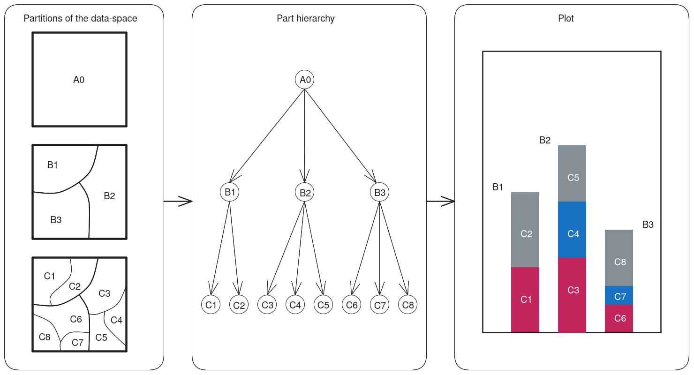

```{r setup, include=FALSE}
knitr::opts_chunk$set(echo = TRUE)
```

# Introduction

## What's in a plot?

There is a subtle yet profound question in the production and use of interactive data visualizations: *when we interact with a plot, what exactly are we interacting with?* On its face, the question might seem trivial. A person clicking a bar in an interactive barplot may be convinced that they are interacting with the coloured rectangle on the screen, since, by design, that is the salient "thing" they see change in front of them. And in some way, this is true - by interacting with the bar, we can affect its graphical attributes: we can change its colour, we can squeeze it/stretch it, and so on. Yet, in another, deeper way, this perception of interacting with a plain geometric object is just an illusion. How so? 

The illusion lies in the fact that the bar is not just the geometric object - the coloured rectangle - it is represented by. Instead, it is only ever meaningful as a bar within the context of the plot. We can see this quite easily. If we were to take the coloured rectangle and transpose it onto a blank area of the screen, we would lose some crucial information that the rest of the plot provides - it would no longer be a "bar" in the same sense that it was before.  

Thus, the fact of being in a plot imbues objects with some additional information or structure, beyond their simple geometry. That statement should not seem too surprising or controversial to people familiar with data visualization. However, it may be more challenging to define in detail what exactly this "structure" is. There are a few ideas we may be able to muster. First of all, we know that the geometric objects in plots are supposed to represent some underlying data. That much is clear - if the objects in a graphic do not represent any external data but are instead drawn according to some arbitrary rules, we cannot really, in good conscience, call the resulting graphic a "plot". But data is only a part of the story. 

When drawing plots, we rarely represent the raw data directly. Instead, we often summarize, aggregate, or transform. We do this by applying mathematical functions such as count, sum, mean, log, or the quantile function. And it is the output of these transformations that we then represent by the geometric objects. 

So, when interacting with a bar in an interactive barplot, we do not just interact with a plain geometric object. Instead, we interact with a mathematical function, or, in fact, several of them. This is very important. Mathematical functions have properties, and these properties impose limits on what kinds of visualizations and interactions we can meaningfully compose. This is the crux of the argument presented in this text. Before diving deeper, however, let's first define some key terms and draw a rough sketch of the data visualization process as a whole. 

## Rough sketch of the data visulization process

To create a data visualization, be it static or interactive, we need several ingredients: data, summaries, scales/coordinate systems, and geometric objects. These should be familiar to most users of interactive data visualization systems. However, it may still be useful to lay them out in order, and examine the specific features and quirks each one of them has.    

First of all, as was mentioned in the previous section, every data visualization needs to be built on top of some underlying data. We can represent this as a set of some arbitrary units of information (data) $D$. Data in the wild usually comes with more structure than that - for example, we often encounter data stored in a tabular ( or "tidy" [CITE]) format, stratified by rows and columns. In that case, we could substitute $D$ by the set of rows $R$, the set of columns $C$, or the set of cell values $R \times C$ (where $\times$ indicates the cartesian product). However, for the purpose of this broad description, we do not have to assume any special structure and just speak of the data units $d \in D$.  

Secondly, at some point during the visualization process, we need to transform the set of data units $D$ into a set of collections of summaries $S$ via a function $\alpha$. The summarizing function $\alpha$ can have many different flavours. It may be the case that $\alpha$ is one-to-one (bijection), in which case there is one summary for every unit of data (and vice versa). This is the case, for example, with the prototypical scatterplot, in which $\alpha$ is just the identity function (every unit of data/row gets assigned one "point"). However, more often, $\alpha$ is many-to-one (surjection), which means that each summary may be composed of multiple units of data. Examples of this include the typical barplot, histogram, density plot, or violin plot. When $\alpha$ is many-to-one, it will typically reduce the cardinality of the data, such that $\lvert S \lvert \leq \lvert D \lvert$ (e.g. in a typical barplot, there will be fewer bars than there are rows of the data, unless each row represents a unique level of the categorical variable). To turn $n$ units of data into $k$ collections of summaries, we need to somehow stratify the data on one or more variables. These variables may either come from the data directly (i.e. the variables used are "factors", as in the case of a barplot or a treemap) or may themselves be a summary of the data (as in the case of histogram bins). Importantly also, each collection of summaries $s \in S$ may (and usually will) hold multiple values, produced by a different constituent function each - for example, the collection $s$ for a single boxplot "box" will consist of the median, the first and third quartile, the minimum and maximum, and the outlier values of some variable, all for a given level of some stratifying variable (which itself will also be an element of $s$). Finally, the output of these constituent functions may also depend on some external parameters, which may be either directly supplied by the user or heuristically inferred from the data by the visualization system itself. Examples of such external parameters include anchor and binwidth in a histogram.

Thirdly, each collection of summaries $s \in S$ needs to be translated from the data- (or summary-) coordinates to graphical coordinates/attributes $g \in G$, via a function $\beta$. This means that each summary value gets mapped or "scaled" to a graphical attribute via a constituent scaling function. Note that this mapping preserves cardinality - there are as many collections of graphical attributes as there are collections of summaries, $\lvert G \lvert = \lvert S \lvert$. For numeric/continuous summaries, the most common type of scales come in the form of linear transformations, such that the minimum and maximum of the data are mapped near the minimum and maximum of the plotting region, respectively. Continuous scales may also provide non-linear transformations such as the log-transformation or binning, and the values may even get mapped to discrete graphical attributes (e.g. binned values may get translated to one of 5 different shades of a single colour). Likewise, discrete summaries may get translated to either continuous (e.g. position) or discrete (e.g. colour) graphical attributes. There are also coordinate systems, which may further translate values from multiple scales simultaneously, e.g. by taking values in cartesian (rectangular plane) coordinates and translating them to polar (radial) coordinates. Either way, $\beta$ can be viewed as one function, representing the composition of any number of scales and coordinate systems applied to various summaries.  

Finally, the collections of graphical attributes/coordinates $g \in G$ are drawn as geometric objects inside the plotting region, which we can represent as the set of pixels $P$. While the act of drawing does take the collections of graphical coordinates $g \in G$ as inputs, it does not simply return an output for each input (like a mathematical function would), but instead mutates the state of the graphical device via a side effect $\gamma^*$, i.e. changing the colour values of pixels in $P$. In other words, how the graphic ends up looking may depend, for example, on the order in which we draw the objects. For example, when drawing points of different colour, some points may end up being plotted over others, and thus the final result may depend on whether we draw red points first and yellow second or vice versa. As such, $\gamma^*$ is not a simple mapping from $G$ to $P$ and we cannot call it a true mathematical function (since that would require it to merely assign an output to each input). The geometric objects may be simple, such as points, lines, or bars, or compound, such as a boxplot or pointrange. Importantly, each attribute necessary to draw the geometric object, such as x- and y-position, width, height, area, etc... needs to be present in the corresponding $g$.     

The whole process can be summarized as follows:

$$D \overset{\alpha}{\to} S \overset{\beta}{\to} G \overset{\gamma^*}{\Rightarrow} P$$

Or, equivalently: 

$$\text{(data)} \overset{\text{summarize}}{\longrightarrow} \text{(summaries)} \overset{\text{translate/encode}}{\longrightarrow} \text{(graph. coordinates)} \overset{\text{draw}^*}{\Rightarrow} \text{(graph. device state)}$$

The above should be fairly non-controversial description of how a data visualization is produced, and applies equally well to static as well as interactive visualizations. 

## Summaries as first-class citizens

In some treatments of data visualization, the summarizing step ($\alpha: D \to S$) is de-emphasized, in one of two ways. In the first case, the data is assumed to arrive pre-summarized, i.e. $S = D$. An example of this would be drawing a barplot from a pre-summarized table of counts. Under this framing, data visualization is just about encoding the data into geometric objects. This may feel very natural when considering plots which show a one-to-one mapping (bijection) between the data and the geometric objects such as the scatterplot or the lineplot/time-series chart. And indeed, in these plots, the summarizing function $\alpha$ is identity, and as such *can* be ignored. 

In the second case, the computation of summaries is considered, however, it is absorbed into the translation step, such that $\alpha = \beta$. As an example of this, we may think of a histogram as directly translating its underlying variable into bin coordinates. Thus, under this framing, data visualization is also about encoding the data into graphics, although in this case there is "more going on" in the encoding step. 

Neither of these two approaches is *wrong*, since, by the very nature of the data visualization process, the functions that were described in the previous sections do *compose*. That is, for example, instead of treating $\alpha$ and $\beta$ as two separate steps in the data visualization "recipe", we can define a new step $\rho = \beta \circ \alpha$ (read "beta after alpha") that absorbs the two functions into itself, taking in the input of $\alpha$ and spitting out the output of $\beta$, i.e. $\rho(d) = \beta(\alpha(d))$. Indeed, this is what we want and expect from our visualization systems - we talk about "visualization" not "summarizing-then-translating-then-drawing".  

However, there is also a disadvantage in composing and abstracting things out into larger blocks. Specifically, the two approaches outlined above produce a tight coupling between summaries and graphical coordinates. The first approach, which assumes that data arrives pre-summarized, makes it awkward to create all but the most simple types of plots - most users of data visualization would probably not enjoy having to go through several data-wrangling steps every time they wanted to display a simple a boxplot. Conversely, the second approach, which absorbs the summarizing step into the translation step, makes it hard to create new types of plots by simply replacing the summary statistics, since these are now tied to the graphics. As such, both approaches are difficult to generalize.      

We can give a much richer and general account of visualizations by treating both the summarizing and the translating step as first class citizens. Importantly, some plots may encode the same summaries through different graphical attributes and geometric objects; other plots may compute different summaries but display them via the same means. As an example of the former, see the examples of histogram and spineplot in Figure \@ref(fig:histospine). Histograms and spineplots use the same summaries, i.e. binned counts of some underlying continuous variable $x$. However, histograms encodes the bin breaks into rectangle boundaries along the x-axis, and the counts as the top rectangle boundary along the y-axis, whereas spineplot encodes the counts into both x- and y-axis rectangle boundaries, with both the x- and the y- dimensions stacked and the y-dimension additionally scaled to 1, and the bin breaks are encoded as x-axis labels. As an example of the latter, scatterplot and bubbleplot both use points/circles to display their underlying summaries, however, whereas the summary for scatterplot is identity (or at least bijective), the summary for bubbleplot involves binning along x- and y- axis.  

```{r histospine, fig.height=3, echo=FALSE, fig.cap="Histogram and spineplot use the same summaries but encode them in different ways. a) In histogram, the x-axis display bin breaks and y-axis displays count, stacked across groups (failure/no failure). b) In spineplot, the x-axis and y-axis both display count; the x-axis shows count stacked across bins, whereas the y-axis shows count stacked across groups and scaled by the total bin count (such that the total bin height = 1). The bin breaks are displayed as x-axis labels (however, the underlying summary is still stacked count)."}

fail <- factor(c(2, 2, 2, 2, 1, 1, 1, 1, 1, 1, 2, 1, 2, 1,
                 1, 1, 1, 2, 1, 1, 1, 1, 1),
               levels = c(1, 2), labels = c("no", "yes"))
temperature <- c(53, 57, 58, 63, 66, 67, 67, 67, 68, 69, 70, 70,
                 70, 70, 72, 73, 75, 75, 76, 76, 78, 79, 81)

breaks <- seq(50, 85, 5)
h1 <- hist(temperature[fail == "yes"], breaks = breaks, plot = FALSE)
h2 <- hist(temperature[fail == "no"], breaks = breaks, plot = FALSE)
h2$counts <- h2$counts + h1$counts

axis_fun1 <- function() {
  axis(1, tick = FALSE, line = -0.5)
  axis(2, tick = FALSE, las = 1, line = -0.5)
  box(bty = "L")
}

cols <- c("grey80", "indianred")
border <- "white"

par(mfrow = c(1, 2))
plot(h2, main = NULL, xlab = "Temperature", ylab = "Count", 
     axes = FALSE, col = cols[1], border = border)
plot(h1, add = TRUE, col = cols[2], border = border)
legend("topleft", legend = c("Failure", "No failure"), col = cols,
       pch = 15, bty = "n", cex = 0.75)
title(main = "a.", adj = 0, line = 0.5)
axis_fun1()

png()
s1 <- invisible(spineplot(fail ~ temperature))
invisible(dev.off())
cumtotal <- c(0, cumsum(rowSums(s1)) / sum(s1))

spineplot(fail ~ temperature, breaks = breaks, xlab = "Temperature", 
          ylab = "Proportion", col = rev(cols), border = border, axes = FALSE)
axis(1, at = cumtotal, labels = breaks, tick = FALSE, line = -0.5)
axis(2, at = 0:4 / 4, labels = 0:4 / 4, tick = FALSE, las = 1, line = -0.5)
title(main = "b.", adj = 0, line = 0.5)
box(col = "white", lwd = 1.5)
box(bty = "L")

```

## A couple of caveats

There are also a few important caveats to the sketch of the data visualization process outlined above. Firstly, while not always the case, *order* can be important. Within the collections of summaries $s \in S$ and graphical attributes $g \in G$ may be ordered. Such is the case, for example, in lineplot, where lines need to be drawn by connecting a series of points in the correct order). Secondly, *hierarchy* can also be important and the collections may form tree/graph-like structure. A particularly relevant example of this is stacking. For example, when drawing a stacked barplot, we need to stack the graphical coordinate values representing the sub-bars on top of each other, such that each sub-bar is stacked within the appropriate parent-bar and in the correct order (e.g. such that sub-bars belonging to group 2 always go on top group 1 sub-bars). If it is the case that order matters for either $\alpha$ or $\beta$, then we cannot call them true functions either, since each of the elements in their domain needs to be aware of the other elements. That is, when stacking bars in a stacked barplot, we need to "remember" what bars we have stacked before. As such, the operation is not a simple mapping.    

Additionally, the data limits (minimum and maximum) and values that are used for scales are often derived from $S$ rather than from the raw data (e.g. the upper y-axis limit in barplot or histogram is the highest count across bins). Further, when $S$ and $G$ have a hierarchical structure, the limits may come from a higher level of hierarchy than the summaries that are actually being drawn - for example, in a stacked barplot, for the upper y-axis limit we need to know the count (height) of the tallest *whole* bar but do not need to know the counts within the stacked sub-bars (since these are, by definition, smaller or equal to the whole bar). 

# Interactivity and Hierarchy

As was briefly mentioned in the section above, the production of visualizations may involve issues of order and hierarchy. These issues affect static and interactive visualizations differently. In static visualizations, all computation is done only once, before the plot is rendered, and so the issues are less important. However, when producing interactive visualizations, we want our visualizations to respond to user's input, which means that some computations may have to be run rapidly and repeatedly, often many times within a single second. If the computation takes a long time to complete, it may result in a sluggish or unresponsive visualization and ruin the immersion of interactivity. As a result, it is imperative to organize the process in such a way that the computation is as fast as possible and, in turn, only as little work as is necessary is done. 

For example, suppose we are computing the summaries underlying a typical interactive stacked histogram, in which the user can interactively change binwidth and anchor, and assign cases of data to groups via linked brushing, which are then represented as different sub-bars of the stacked bars. Thus, the plot has to change in response to three sources of interaction: changing the binwidth, changing the anchor, and brushing. 

One option of rendering this histogram may be to specify the whole plot declaratively. That is, we may define a single-step "recipe" for transforming the data (including the binwidth and anchor parameters, and a group-index variable) into summaries and rendering those (e.g. the way `ggplot2` does it; [CITE]). Then, each time one the interactive variables changes, we re-render the plot. 

However, this approach may be wasteful. To see this, let's first describe what summaries we will need to draw the plot. With a bit of hand-waving, to draw the stacked histogram bars, we need the bin coordinates (lower and upper bound) as well as the count for each sub-bar. This means that there will be one set of summaries for each pairwise combination of $\textbf{bin} \times \textbf{group}$ variables, as long as that combination is actually present in the data. The $\textbf{group}$ variable changes in response to brushing. The $\textbf{bin}$ variable, however, does not change in response to brushing - it only changes when the user changes the binwidth or anchor parameters. 

```{r hierarchy}
#| echo: false
#| fig-cap: "Reactive hierarchy in a stacked histogram. When selection changes (as a result of linked brushing), we do not need to recompute bins, since these depend just on the data, anchor, and binwidth (= parent nodes). Instead, we only need to recompute count within each sub-bar, defined by combinations of bin and group. However, when either anchor or binwidth change, we do need to recompute the bins, and as a result counts as well (= child nodes)."

library(grid)

draw_node <- function(x, y, r, label, draw_label = TRUE) {
  grid.circle(x, y, r, name = label)
  if (draw_label) grid.text(label, x, y, gp = gpar(cex = 0.75))
  
}

draw_edge <- function(node1, node2, theta1, theta2, arrow) {
  grid.segments(grobX(node1, theta1), grobY(node1, theta1),
                grobX(node2, theta2), grobY(node2, theta2),
                arrow = arrow)
}

grid.newpage()
arrow1 <- arrow(length = unit(0.1, "inches"))
draw_node(6/14, 5/6, 0.1, "Data")
draw_node(8/14, 3/4, 0.075, "Binwidth")
draw_node(4/14, 3/4, 0.075, "Anchor")
draw_node(6/14, 1/2, 0.075, "Bins")

draw_edge("Data", "Bins", 270, 90, arrow1)
draw_edge("Binwidth", "Bins", 220, 60, arrow1)
draw_edge("Anchor", "Bins", 320, 120, arrow1)

draw_node(8/14, 1/2, 0.075, "Selection")
draw_node(6/14, 1/4, 0.075, "Counts")

draw_edge("Bins", "Counts", 270, 90, arrow1)
draw_edge("Selection", "Counts", 220, 60, arrow1)

```

As such, if we re-run the entire computation pipeline each time the user performs linked brushing, we are performing a lot of unnecessary computation. Specifically, there is no need to recompute the bins - as long as all the user is doing is brushing, the $\textbf{bin}$ variable will not change. All we need to do is recompute the counts within sub-bars (defined as $\textbf{bin} \times \textbf{group}$). However, when the user interactively changes either the anchor or the binwidth parameters, we do need to recompute the whole pipeline. The parameters and variables thus form a reactive hierarchy, as displayed in Figure \ref{fig:hierarchy}.   

Thus, if we want our interactive visualizations to be performant, we need to model the hierarchical structure of some summaries in the implementation of our interactive data visualization system. At least some parts of our computation pipeline need to form a reactive graph, such that child nodes recompute whenever the parent nodes change, but not vice versa. 

# The Problem of Statistical Summaries

There is an even deeper issue when it comes to interactivity and statistical summaries of the data. Specifically, not every statistical summary "works" equally well - instead, some summaries may be better than others. Let's first illustrate the problem with a case study.

## Case study: Counts and Means

Linked brushing or highlighting is one of the most popular and useful types of interactive features used in interactive data visualizations [CITE]. It allows the user to select objects (such as points or bars) within one plot by e.g. clicking or clicking-and-dragging, and the corresponding cases (rows of the data) are then highlighted in all other plots. The usefulness of linked brushing comes from the fact that allows the user to rapidly "drill-down" [CITE] and explore the summaries that would result from subsetting different rows of the data, within the context of the entire dataset.  

Now, let's imagine we have three interactive plots: a classical scatterplot, a barplot of summarizing the count of cases within the levels of some categorical variable $x$, and a barplot summarizing the mean of some other variable $y$, within levels of the same categorical variable $x$. The plots are linked such clicking/clicking-and-dragging on one produces a visual change in the others, by highlighting the corresponding cases of data. Intuitively, it might seem that the barplot of counts and the barplot of means should be equally valid/useful representations of the data. However, if we consider these plots in the context of linked brushing, few subtle-yet-fundamental differences emerge. 

```{r empty, echo=FALSE }
#| fig.height: 3
#| fig.cap: "The problem of representing empty selection. a) An illustration of selection by linked brushing. b) In the barplot of counts, the count within an empty selection (red) is zero and so an absence of a bar accurately represents a count of zero. c) In the barplot of means, the mean of an empty selection is not defined. Absence of a bar could indicate that either no cases are selected or some cases are selected and their mean is equal to the lower y-axis limit (zero in this case)."

wt <- mtcars$wt
mpg <- mtcars$mpg
cyl <- mtcars$cyl
disp <- mtcars$disp
one <- numeric(nrow(mtcars)) + 1

cyl_unique <- c(4, 6, 8)

wt_lim0 <- 1.45
wt_lim1 <- 2.5
mpg_lim0 <- 25
mpg_lim1 <- 34.5

cyl_unique <- c(4, 6, 8)

selected <- ((wt > wt_lim0) & (wt < wt_lim1) & (mpg > mpg_lim0) & mpg < mpg_lim1)
col <- c("grey80", "indianred")[selected + 1]
selected_cyls <- c(4, 6, 8) %in% unique(cyl[selected])

bars11 <- tapply(one, cyl, sum)
bars12 <- tapply(one[selected], cyl[selected], sum)

bars21 <- tapply(disp, cyl, mean)
bars22 <- tapply(disp[selected], cyl[selected], mean)

axis_fun1 <- function() {
  axis(1, tick = FALSE, line = -0.5)
  axis(2, tick = FALSE, las = 1, line = -0.5)
  box(bty = "L")
}

axis_fun2 <- function() {
  axis(1, at = c(4, 6, 8), tick = FALSE, line = -0.5)
  axis(2, tick = FALSE, las = 1, line = -0.5)
  box(bty = "L")
}

par(mfrow = c(1, 3), mar = c(5, 4, 2, 0.5))

plot(wt, mpg, pch = 20, col = col, cex = 2,
     axes = FALSE, xlab = "Weight", ylab = "Mileage")
rect(wt_lim0, mpg_lim0, wt_lim1, mpg_lim1, lty = "dashed")
title(main = "a.", adj = 0, line = 0.5)
axis_fun1()

barx <- c(4, 6, 8)
barx0 <- barx - 0.75
barx1 <- barx + 0.75

barx_selected<- barx[selected_cyls]
barx_notselected <- barx[!selected_cyls]
barx0_selected <- barx0[selected_cyls]
barx1_selected <- barx1[selected_cyls]
barx0_notselected <- barx0[!selected_cyls]
barx1_notselected <- barx1[!selected_cyls]

plot(c(2, 10), c(0, max(bars11)), type = "n", 
     axes = FALSE, xlab = "Cylinders", ylab = "Count")
rect(barx0, 0, barx1, bars11,
     col = "grey80", border = NA)
rect(barx0_selected, 0, barx1_selected, bars12,
     col = "indianred", border = NA)
text(barx, c(bars12, 0, 0) + 0.75, labels = c(bars12, "0", "0"),
     col = "indianred")
title(main = "b.", adj = 0, line = 0.5)
axis_fun2()

plot(c(2, 10), c(0, max(bars21)), type = "n",
     axes = FALSE, xlab = "Cylinders", ylab = "Mean displacement")
rect(cyl_unique - 0.75, 0, cyl_unique + 0.75, bars21,
     col = "grey80", border = NA)
rect(barx0_selected, 0, barx1_selected, bars22,
     col = "indianred", border = NA)
rect(barx0_notselected, 0, barx1_notselected, 100,
     col = NA, border = "indianred", lty = "dashed")
text(barx_notselected, 50, labels = "?", col = "indianred", cex = 1.5)
text(barx_selected, bars22 + 10, labels = round(bars22), col = "indianred")
title(main = "c.", adj = 0, line = 0.5)
axis_fun2()

```

## Empty selections

Firstly, as is shown in Figure \@ref(fig:empty), how do we draw an empty selection? In the case of counts, we have a meaningful default value - zero - as in "the number of cases in an empty selection is zero". In other words, the absence of a bar in a barplot unambiguously communicates that the count for the corresponding level of the stratifying variables is zero.

However, for means, there is no such default value: the mean of an empty set is not defined. As a result, whenever we encounter an empty selection, we are faced with the problem of how to represent it. We could choose not to draw the bar representing the empty selection, however, that decouples the statistical summary from the visual representation. That is, the absence of a bar may now indicate that *either* no cases are selected *or* that some cases are selected and that their mean is equal to the lower y-axis limit. 

```{r bigger}
#| echo: FALSE
#| fig.height: 3
#| fig.cap: "The relationship between selection vs. the whole. a) An illustration of selection by linked brushing. b) In the barplot of counts (middle), the count within a selection (red) is always less than or equal to the count within the whole and the outline of the bars does not change. c) In the barplot of means, the mean of a selection can be greater and so the outline of the bars will change in response to user input."

wt <- mtcars$wt
mpg <- mtcars$mpg
cyl <- mtcars$cyl
disp <- mtcars$disp
one <- numeric(nrow(mtcars)) + 1

cyl_unique <- c(4, 6, 8)

wt_lim0 <- 2
wt_lim1 <- 3.5
mpg_lim0 <- 20
mpg_lim1 <- 26.5

selected <- ((wt > wt_lim0) & (wt < wt_lim1) & (mpg > mpg_lim0) & mpg < mpg_lim1)
col <- c("grey80", "indianred")[selected + 1]
selected_cyls <- c(4, 6, 8) %in% unique(cyl[selected])

bars11 <- tapply(one, cyl, sum)
bars12 <- tapply(one[selected], cyl[selected], sum)

bars21 <- tapply(disp, cyl, mean)
bars22 <- tapply(disp[selected], cyl[selected], mean)

axis_fun1 <- function() {
  axis(1, tick = FALSE, line = -0.5)
  axis(2, tick = FALSE, las = 1, line = -0.5)
  box(bty = "L")
}

axis_fun2 <- function() {
  axis(1, at = c(4, 6, 8), tick = FALSE, line = -0.5)
  axis(2, tick = FALSE, las = 1, line = -0.5)
  box(bty = "L")
}

par(mfrow = c(1, 3), mar = c(5, 4, 2, 0.5))

plot(wt, mpg, pch = 20, col = col, cex = 2,
     axes = FALSE, xlab = "Weight", ylab = "Mileage")
rect(wt_lim0, mpg_lim0, wt_lim1, mpg_lim1, lty = "dashed")
title(main = "a.", adj = 0, line = 0.5)
axis_fun1()

barx <- c(4, 6, 8)
barx0 <- barx - 0.75
barx1 <- barx + 0.75

barx_selected<- barx[selected_cyls]
barx_notselected <- barx[!selected_cyls]
barx0_selected <- barx0[selected_cyls]
barx1_selected <- barx1[selected_cyls]
barx0_notselected <- barx0[!selected_cyls]
barx1_notselected <- barx1[!selected_cyls]

plot(c(2, 10), c(0, max(bars11)), type = "n", 
     axes = FALSE, xlab = "Cylinders", ylab = "Count")
rect(barx0, 0, barx1, bars11,
     col = "grey80", border = NA)
rect(barx0_selected, 0, barx1_selected, bars12,
     col = "indianred", border = NA)
text(barx, c(bars12, 0, 0) + 0.75, labels = c(bars12, "0", "0"),
     col = "indianred")
title(main = "b.", adj = 0, line = 0.5)
axis_fun2()

plot(c(2, 10), c(0, max(bars21)), type = "n",
     axes = FALSE, xlab = "Cylinders", ylab = "Mean displacement")
rect(cyl_unique - 0.75, 0, cyl_unique + 0.75, bars21,
     col = "grey80", border = NA)
rect(barx0_selected, 0, barx1_selected, bars22,
     col = adjustcolor("indianred", 0.5), border = NA)
rect(barx0_notselected, 0, barx1_notselected, 100,
     col = NA, border = "indianred", lty = "dashed")
text(barx_notselected, 50, labels = "?", col = "indianred", cex = 1.5)
text(barx_selected, bars22 + 10, labels = paste0(round(bars22), "!"), col = "indianred")
title(main = "c.", adj = 0, line = 0.5)
axis_fun2()

```

## Part vs. the whole

Second, as shown in Figure \@ref(fig:bigger), how does the summary on the selection relate to the summary on the whole? In the case of the barplot of counts, the height of the sub-bar is always less than or equal ($\leq$) to the height of the whole bar (because so is the count). Thus, we can always draw the sub-bar over the whole bar, and the whole bar act as a stable visual reference - the outline of the bars stacked on top of each other will remain the same no matter which cases of the data are selected. In fact, we can either draw the whole bar (as shown in grey in Figure \@ref(fig:bigger)) and draw the selected sub-bar (red) over it, both starting from the y-axis origin (0), or we can draw a red sub-bar and the "leftover" grey-sub bar stacked on top, starting from the top y-coordinate of the selection bar and with $\textbf{height} = (\text{count of the whole} - \text{count of the selection})$. The resulting geometric objects will be visually identical.

The barplot of means does not share this property. Specifically, the "sub-bars" can be taller than the whole bar (because the mean of a subset can be greater than the mean of the original set). As a result, if we draw the selection sub-bars on top of the whole bar, the whole bar may become completely obscured by the sub-bar (as shown in Figure \@ref(fig:bigger)). We could choose to draw the selection sub-bars as semitransparent, or draw the the bars side-by-side instead of on top of each other (i.e. technique known as "dodging"), however, the question then remains how to display the non-selected (grey) cases - do we draw the "whole" bar that remains the same height throughout interaction, or the "leftover" bar whose height changes with the selection? Also, if we choose to draw the bars side-by-side, will the whole bar be initially wide and shrink in response to selection to accommodate the selection bars, or will it be narrow from the initial render? Finally, if the user brushes the side-by-side bars, will they be able to select individual bars or will brushing one select all of them? 

## Combining parts

Finally, as displayed in Figure \@ref(fig:stacking), when multiple selections/groups are present, can we combine them in a meaningful way? Again, in the case of the barplot of counts, there is an idiomatic way to do this: we can stack the counts across the selection groups and the corresponding bars on top of each other, and the height of the resulting bar will be identical to the count of the whole. And, as in the case of a single selection group, we are free to either draw the bars over each other, starting from the y-axis origin, or draw sub-bars stacked on top of each other, each starting where the last left off.

There is no such meaningful way to combine means. If we were to stack the bars on top of each other, the resulting statistic (the sum of the group means) would hardly ever be informative. Worse yet, if we were to take the mean of the group means, the resulting statistic will almost surely be different from the mean of the whole: the mean of the group means $\neq$ the grand mean. And again, as was mentioned in the previous section, the grand mean may be less than any one of the group means. Since we cannot meaningfully combine the statistics, we could draw the bars side-by-side, but again, we run into considerations about how to render the base group and the selection, and how to choose the bar width.

```{r stacking}
#| echo: false
#| fig-height: 3
#| fig-cap: "Combining selections. a) An illustration of selection by linked brushing, with two groups. b) In the barplot of counts, statistics can be stacked on top of each other such that the count of the stacked bar is identical to the count of the whole bar (i.e. one that would result from no selections). c) In the barplot of means, no such procedure for combining statistics exists."

wt <- mtcars$wt
mpg <- mtcars$mpg
cyl <- mtcars$cyl
disp <- mtcars$disp
one <- numeric(nrow(mtcars)) + 1

cyl_unique <- c(4, 6, 8)
group1 <- (wt > 2.5) & (wt < 4.5) & (mpg < 18.5)
group2 <- (wt > 2.5) & (wt < 4.5) & (mpg > 18.5)

group <- group1 * 1 + group2 * 2 + 1
cols <- c("grey80", "steelblue", "indianred")
col <- cols[group]


axis_fun1 <- function() {
  axis(1, tick = FALSE, line = -0.5)
  axis(2, tick = FALSE, las = 1, line = -0.5)
  box(bty = "L")
}

axis_fun2 <- function() {
  axis(1, at = c(4, 6, 8), tick = FALSE, line = -0.5)
  axis(2, tick = FALSE, las = 1, line = -0.5)
  box(bty = "L")
}

bars11 <- tapply(one, cyl, sum)
bars12 <- tapply(one, list(cyl, group), sum)
bars12[is.na(bars12)] <- 0

bars21 <- tapply(disp, cyl, mean)

par(mfrow = c(1, 3), mar = c(5, 4, 2, 0.5))

plot(wt, mpg, pch = 19, col = col, cex = 1.5,
     axes = FALSE, xlab = "Weight", ylab = "Mileage")
title(main = "a.", adj = 0, line = 0.5)
axis_fun1()

plot(c(2, 10), c(0, max(bars11)), type = "n",
     axes = FALSE, xlab = "Cylinders", ylab = "Count")
rect(cyl_unique - 0.75, 0, cyl_unique + 0.75, bars11, 
     col = "grey80", border = NA)
for (i in 1:3) {
  counts <- bars12[i, ]
  y0 <- cumsum(c(0, counts[-length(counts)]))
  y1 <- cumsum(counts)
  
  rect(cyl_unique[i] - 0.75, y0, cyl_unique[i] + 0.75, y1, 
       col = cols, border = NA)
} 
text(c(4, 4, 6, 6, 8, 8, 8), c(8, 11, 2, 7, 3, 12, 14) - 0.75, 
     labels = c("+8", "+3", "+2", "+5", "+3", "+9", "+2"), 
     col = c("grey40", "white", "white", "white", "grey40", 
             "white", "white"))
title(main = "b.", adj = 0, line = 0.5)
axis_fun2()

plot(c(2, 10), c(0, max(bars21)), type = "n",
     axes = FALSE, xlab = "Cylinders", ylab = "Mean displacement")
rect(cyl_unique - 0.75, 0, cyl_unique + 0.75, bars21, 
     col = "grey80", border = NA)
text(rep(c(4, 6, 8), each = 3), rep(25 * 1:3, 3), labels = "?",
     col = rep(c("grey40", "steelblue", "indianred"), 3))
title(main = "c.", adj = 0, line = 0.5)
axis_fun2()


```

## Some statistics are better than others

To summarize, counts, as implemented in a typical barplot, provide:

a. An unambiguous way to display empty selections (absence of a bar indicates a count of zero)
b. A stable visual reference (the count within a sub-bar $\leq$ the count within the whole bar)
c. A way to combine the statistics together (the sum of the sub-bar counts = the count of whole bar). 

Means do not share these nice properties: mean of an empty selection is not defined, the mean of a selection is not always subordinate to the mean of the whole, and the mean of group means is different from the grand mean. Importantly, these properties or lack thereof are not tied to any specific plot type (e.g. a barplot) but are instead tied to the underlying statistic (count/mean).

We could, of course, think of a way to display means such that linked brushing would be possible in some way. The key point, however, is that to make this kind of interactive visualization, many decisions need to be made in order to produce a visualization that is at least somewhat coherent. Consequently, since many of these decision are somewhat arbitrary and none is more "natural" than any other, a person who interacts with a linked barplot of means for the first time may be surprised in how the plot behaves. For the barplot of counts, on the other hand, there *are* such natural solutions readily available. This may in fact explain why barplots of counts are popular in systems which implement linked brushing - they are popular precisely because they feel natural, in some way. 

One might also wonder if these problems are just a quirk of linked brushing. However, one runs into them in static plots as well, for example with stacking in general (although here perhaps the issue is not as salient as with linked brushing). Further, we can run into the same issues with any other interactivite features that deal with summary statistics computed on several parts of the data. If, for example, on top of linked brushing, we wanted to implement a pop-up window that displays summary statistics within a given object as text, we would still have to contend with how to display the mean of an empty selection. Here, there is perhaps a simple solution: we could display an `NA`, `undefined`, or an empty string, `""`. However, by doing this, we have to step outside of the value type that non-empty selections have (real number/`float`). Depending on what type of statistical software we use, this may or may not be a problem. However, even if it is not a problem, or there exists some way around the problem (as it most likely does), it still does add complexity to our code, since whatever functions rely on means (such as the display function) now have to be generic over `float` and `NA`/`underfined`/`""`. Conversely, there is something natural about counts having the value for empty selection (zero) be of the same type as all other values (integers).       

Returning to the properties of counts, are counts uniquely "good" in this regard? The short answer is "no". For example, sums or products (of values $\geq 1$) conform to the same nice properties we listed above. In other words, in the context of linked brushing, a stacked barplot will behave equally well if it display sums (not surprising) or products (perhaps somewhat surprising?). In fact, there is whole a class of mathematical functions, or more precisely mathematical structures, that share these nice properties. To discuss these, let's first lay the groundwork with some relevant theory.   

# Few Relevant Bits of Category Theory

## Functions

A function is a mapping between two sets. More specifically, let $S$ be the set of sources (also called the *domain*) and $T$ be the set of possible targets (also called the *codomain*). Then, one way to think of a function is as a subset $F \subseteq S \times T$ of valid source-target pairs $(s, t)$, such that for every $s \in S$ in there exists a unique $t \in T$ with $(s, t) \in F$. The function can then be thought of as the process of picking a target for any valid source it is given.

If every target in the function's codomain can be reached via the function, that is, if for a function $f$ and for all $t \in T$ there exists a $s \in S$ such that $f(s) = t$, then we call the function a *surjective* or *onto* function, see Figure \ref{fig:functions}a. If each source leads to a unique target, i.e. for $s_1, s_2 \in S$, if $f(s_1) = t$ and $f(s_2) = t$, then $s_1 = s_2$, then it is an *injective* or *one-to-one* function, see Figure \ref{fig:functions}b. Also, for any given subset of targets, we can ask about the subset of sources that could have produced them, a *pre-image*. That is, for $T_i \subseteq T$ we can define $f^{-1}(T_i) = \{ s \in S \lvert f(s) \in T_i \}$. 

If the domain of one function matches the codomain of another, the functions can be composed to form a new function. Specifically, if we have two functions $f: X \to Y$ and $g: Y \to Z$, we can form a new function $h = g(f(x)) = g \circ f$ (read "$g$ after $f$") such that $h: X \to Z$.

```{r functions}
#| echo: false
#| fig-height: 3
#| fig-cap: "Two types of functions: a) surjective, b) injective."

library(gridExtra)

domain_pts1 <- seq(0.25, 0.75, 0.05)
codomain_pts1 <- seq(0.35, 0.65, 0.05)
mapping1 <- c(1, 1, 2, 2, 3, 4, 4, 4, 5, 6, 7)

codomain_pts2 <- domain_pts1
domain_pts2 <- codomain_pts2[-c(1, length(codomain_pts2))]

grid.newpage()
grid.text("a.", 0.1, 0.9, gp = gpar(fontface = "bold"))
pushViewport(viewport(x = 0.25, width = 0.5))
grid.ellipse(0.5, 0.75, 15, pi / 2, 0.2)
grid.ellipse(0.5, 0.25, 15, pi / 2, 0.2)
grid.points(domain_pts1, rep(0.75, length(domain_pts1)), 
            default.units = "npc")
grid.points(codomain_pts1, rep(0.25, length(codomain_pts1)), 
            default.units = "npc")
grid.segments(domain_pts1, rep(0.75, length(domain_pts1)),
              codomain_pts1[mapping1], rep(0.25, length(domain_pts1)),
              arrow = arrow(length = unit(0.025, "npc")))

popViewport()
pushViewport(viewport(x = 0.75, width = 0.5))
grid.text("b.", 0.1, 0.9, gp = gpar(fontface = "bold"))
grid.ellipse(0.5, 0.75, 15, pi / 2, 0.2)
grid.ellipse(0.5, 0.25, 15, pi / 2, 0.2)
grid.points(domain_pts2, rep(0.75, length(domain_pts2)), 
            default.units = "npc")
grid.points(codomain_pts2, rep(0.25, length(codomain_pts2)), 
            default.units = "npc")
grid.segments(domain_pts2, rep(0.75, length(domain_pts2)),
              domain_pts2, rep(0.25, length(domain_pts2)),
              arrow = arrow(length = unit(0.025, "npc")))

```

## Partitions

One useful thing we can do with functions is to form partitions. Specifically, given some arbitrary set $A$, we can assign every element a label from a set of part labels $P$ via a surjective function $f : A \to P$. Conversely, we can then take any part label $p \in P$ and recover the corresponding subset of $A$ by pulling out its pre-image: $f^{-1}(p) = A_p \subseteq A$. We can use this to define partitions in another way, without reference to $f$: a partition of $A$ consists of a set of part labels $P$, such that, for all $p \in P$, there is a non-empty subset $A_p$ and:

$$A = \bigcup_{p \in P} A_p \qquad \text{and} \qquad \text{if } p \neq q, \text{ then } A_p \cap A_q = \varnothing$$
I.e. the parts $A_p$ jointly cover the entirety of $A$ and parts cannot share any elements.

We can rank partitions by their coarseness. That is, for any set $A$, the coarsest partition is one with only one part label $P = \{ 1 \}$, such that each element of $A$ gets assigned $1$ as label. Conversely, the finest partition is one where each element gets assigned its own unique part label, such that $\lvert A \lvert = \lvert P \lvert$. Finally, given two partitions, we can form a finer (or at least as fine) partition by taking their intersection, i.e. by taking the set of all unique pairs of labels that co-occur for any $a \in A$ as the new part labels. For example, if $A = \{ 1, 2, 3 \}$ and partition 1 assigns part labels $P_1 = \{x, y \}$ to $A$ such that $f_1(1) = x, \; f(2) = x, \; f(3) = y$, and partition 2 assigns part labels $P_2 = \{ \rho, \sigma \}$ such that $f_2(1) = \rho, \; f_2(2) = \sigma, \; f_2(3) = \sigma$, then the intersection partition will have part labels $P_3 = \{ (x, \rho), (x, \sigma), (y, \sigma) \}$ such that $f_3(1) = (x, \rho), \; f_3(2) = (x, \sigma), \; f_3(3) = (y, \sigma)$.   

## Preorders

A preorder is a set $X$ equipped with a binary relation $\leq$ that conforms to two simple properties:

1. $x \leq x$ for all $x \in X$ (reflexivity)
2. if $x \leq y$ and $y \leq z$, then $x \leq z$, for all $x, y, z \in X$ (transitivity)

Simply speaking, this means that between any two elements in $X$, there either is a relation and the elements relate (one element is somehow "less than or equal" to the other), or the two elements do not relate. 

An example of a preorder is the family tree, with the underlying set being the set of family members: $X = \{  \textbf{daughter}, \textbf{son}, \textbf{mother}, \textbf{father}, \textbf{grandmother}, ... \}$ and the binary relation being ancestry or familial relation. Thus, for example, $\textbf{daughter} \leq \textbf{father}$, since the daughter is related to the father, and $\textbf{father} \leq \textbf{father}$, since a person is related to themselves. However, there is no relation ($\leq$) between $\textbf{father}$ and $\textbf{mother}$ since they are not related. Finally, since $\textbf{daughter} \leq \textbf{father}$ and $\textbf{father} \leq \textbf{grandmother}$, then, by reflexivity, $\textbf{daughter} \leq \textbf{grandmother}$.

We can further restrict preorders by imposing additional properties, such as:

3. If $x \leq y$ and $y \leq x$, then $x = y$ (anti-symmetry)
4. Either $x \leq y$ or $y \leq x$ (comparability)

If a preorder conforms to 3., we speak of a partially ordered set or *poset*. If it conforms to both 3. and 4., then it is a *total order*. 

## Monoids

A monoid is a tuple $(M, e, \otimes)$ consisting of:

a. A set of objects $M$
b. A neutral element $e$ called the *monoidal unit*
c. A binary function $\otimes: M \times M \to M$ called the *monoidal product*

Such that:

1. $m \otimes e = e \otimes m = m$ for all $m \in M$ (unitality)
2. $m_1 \otimes (m_2 \otimes m_3) = (m_1 \otimes m_2) \otimes m_3 = m_1 \otimes m_2 \otimes m_3$ for all $m_1, m_2, m_3 \in M$ (associativity)

In simple terms, monoids encapsulate the idea that *the whole is exactly the "sum" of its parts* (where "sum" can be replaced by the monoidal product). Specifically, we have some elements and a way to combine them, and when we combine the same elements, no matter where we put the brackets we always get the same result (i.e. something like "the order does not matter", although that is not precisely right, more on that later). Finally, we have some neutral element that when combined with an element yields back the same element.  

For example, take summation on natural numbers, $(\mathbb{N}, 0, +)$:

$$1 + 0 = 0 + 1 = 1 \qquad \text{(unitality)}$$
$$1 + (2 + 3) = (1 + 2) + 3 = 1 + 2 + 3 \qquad \text{(associativity)}$$

Likewise, products of real numbers $(\mathbb{R}, 1, \times)$ are also a monoid, and so is multiplication of $n \times n$ square matrices $(\mathbf{M}_{n \in \mathbb{Z}}, \mathbf{I}, \cdot)$, where $\mathbf{I}$ is the identity matrix and $\cdot$ stands for an infix operator that is usually omitted. As a counterexample, exponentiation does not meet the definition of a monoid, since it is not associative: $x^{(y^z)} \neq (x^y)^z$. 

We may want to impose further restrictions on monoids, for example:

3. $m_1 \otimes m_2 = m_2 \otimes m_1$ for all $m_1, m_2 \in M$ (commutativity)

Both commutativity and associativity can both be viewed as a kind of "order does not matter" rule, however, they are fundamentally different. Let's imagine our set of objects consists of three wires of different colours $\{ \textbf{red}, \textbf{green}, \textbf{blue} \}$ and the monoidal product consists of connecting wires. Let's also imagine that the $\textbf{red}$ wire is connected to a power source and the $\textbf{blue}$ wire is connected to a lightbulb, and the blue wire amplifies the current from the power source such that it is enough to power the light bulb. To turn on the lightbulb, we need to connect $\textbf{red} \to \textbf{green}$ and $\textbf{green} \to \textbf{blue}$. The time order in which we connect the three wires does not matter: we can connect $\textbf{green} \to \textbf{blue}$ first and $\textbf{red} \to \textbf{green}$ second or vice versa, either way we get the same result (lightbulb turns on). However, the spatial order in which we connect the wires *does* matter: if we connect $\textbf{red} \to \textbf{blue}$, then the current will not be enough to power the lightbulb. Hence, the operation is associative (temporal order does not matter) but not commutative (spatial order does matter).      

If $M$ is a preorder, another restriction we may want to impose is that the monoidal product is strictly increasing:

4. $m_1 \leq m_1 \otimes m_2$ and $m_2 \leq m_1 \otimes m_2$ for all $m_1, m_2 \in M$ (monotonicity)

This means that when we combine two things, we get back something that's at least as big as the bigger of the two things. Summation of natural numbers $(\mathbb{N}, 0, +)$ again works, but for example summation of integers $(\mathbb{Z}, 0, +)$ or multiplication of reals $(\mathbb{R}, 1, \times)$ does not. 

# Outline of the Model

Armed now with some rudimentary theory, we can attempt to describe the data visualization process in more detail. 

## Data and partitions

We again start with the data $D$ which is just some set of values that may or may not be structured. Ultimately, our goal is to try and learn something new from the data. To this end, we want to create a visualization that will show the information from the data through graphical elements, primarily geometric objects such as points, lines, or areas (we may also use, for example, text/symbols). 

First of all, we need to think about how the information from the data will be distributed among the objects. To start with the simplest case, sometimes we might want all information in the data to go into a single geometric object. This may be a perfectly good way to display information about the entire data set. Examples of plots with a single geometric object may include time series plot (line), density plot (density polygon), or radar chart (pentagon/other polygon).

However, often, we want to compare and contrast different parts of the data. And this is where we have to start to think more deeply about how information should be allocated. For example, it would not be very useful to draw multiple identical geometric objects representing the same information from the data - if all of the objects looked the same, we could learn the same information from any one of them and so it is redundant to have more than one. Instead, we want each object to represent different aspects of the data and so we need to think about slicing the data up along some axis or axes.  

Often, there are some axes along which we can slice already present in the structure of the data. For example, a lot of data comes organized in a tabular $R \times C$ format where $R$ is the set of rows and $C$ is the set of columns (and $R \times C$ are the cells), and so we could use any of these three sets as the basis for drawing our geometric objects. This is shown in Figure \@ref(fig:partitioning). Notice that, when slicing along rows $R$, the number of objects (points) is equal to their cardinality: $\textbf{\# objects} = \lvert R \lvert$. Likewise, when slicing along columns, $\textbf{\# objects} = \lvert C \lvert$, and when slicing along cells, $\textbf{\# objects} = \lvert R \times C \lvert$.

```{r partitioning}

#| echo: FALSE
#| fig.height: 4
#| fig.cap: "Three ways of partitioning a tabular data set. a) The underlying data, represented as a matrix with 3 rows and 2 columns. b) To draw a scatterplot, we can slice along the rows and draw points at the x- and y-position given by the columns. c) To draw a lineplot, we can slice along the columns & draw lines by connecting points given by the corresponding row values. d) To draw a dotplot, we can slice along both rows and columns and draw points at given row and column index, with point size given by the corresponding cell value."}

library(gridExtra)

set.seed(123)
data <- matrix(sample(1:6), ncol = 2)

lims <- range(data)
scatlims <- apply(data, 2, range) + c(-1, 1)

lay1 <- matrix(c(1, 3, 2, 4), ncol = 2)
layout(lay1)
par(mar = c(2.5, 2.5, 1.5, 1.5))

plot(rep(1:2, 3), rep(1:3, 2), type = "n", axes = FALSE,
     xlab = NA, ylab = NA, xlim = c(0.5, 2.5), ylim = c(0.5, 3.5))
abline(v = 1.5, col = "grey60")
abline(h = c(1.5, 2.5), col = "grey60")
text(label = data[3:1, ], rep(1:2, 3), rep(1:3, 2))
box(col = "grey60")
title(main = "a.", adj = 0, line = 0.5)
title(ylab = "Rows", line = 0.5)
title(xlab = "Columns", line = 0.5)

plot(data[, 1], data[, 2], pch = 19, col = "steelblue",
     axes = FALSE, xlab = NA, ylab = NA,
     xlim = scatlims[, 1], ylim = scatlims[, 2])
axis(1, line = -3/4, tick = FALSE)
axis(2, line = -3/4, tick = FALSE, las = 1)
title(xlab = "Column 1", line = 1.5)
title(ylab = "Column 2", line = 1.5)
title(main = "b.", adj = 0, line = 0.5)
box(bty = "L", col = "grey60")

plot(data[, 1], type = "l", ylim = lims,
     xlab = NA, ylab = NA,
     axes = FALSE, col = "steelblue")
lines(data[, 2], ylim = lims, col = "steelblue")
axis(1, 1:3, line = -3/4, tick = FALSE)
axis(2, line = -3/4, tick = FALSE, las = 1)
title(xlab = "Row index", line = 1.5)
title(ylab = "Column", line = 1.5)
title(main = "c.", adj = 0, line = 0.5)
box(bty = "L", col = "grey60")

plot(rep(1:3, 2), rep(1:2, 3), 
     pch = 19, cex = data / sqrt(2), 
     xlim = c(0, 4), ylim = c(0, 3),
     col = "steelblue", axes = FALSE, 
     xlab = NA, ylab = NA)
axis(1, 1:3, line = -3/4, tick = FALSE)
axis(2, 1:2, line = -3/4, tick = FALSE, las = 1)
title(main = "d.", adj = 0, line = 0.5)
title(xlab = "Column index", line = 1.5)
title(ylab = "Row index", line = 1.5)
box(bty = "L", col = "grey60")

```

However, there is no reason to limit ourselves to slicing along axes that are already present in the structure of the data - we can also create new axes. For example, when computing the statistics underlying the classical barplot, we can slice along the levels of some discrete variable $x$. Likewise, when drawing a histogram or a heatmap, we can bin some continuous variable(s) and slice along the bins. If we are making an interactive visualization, we can make the slicing axis responsive to user input, for example, we might let the user change the histogram bin width and anchor interactively. 

Now, when slicing along any given axis or axes, a question remains *how* to slice. There are two key points to mention. Firstly, no matter how we perform the slicing, every unit of data $d \in D$ should probably end up in *some* slice, i.e. our slicing operation should not discard or "throw away" any data. This seems obvious - we want the visualization to be an accurate and complete representation of the data, and as such we cannot simply leave anything out arbitrarily. Secondly, we also probably want each unit of the data to end up in *one slice only*. This point is a bit more subtle. Suppose, for example, that we were tasked with plotting data for a company, and we were given as data a set of $\textbf{employees}$ and a set of $\textbf{managers}$, with every manager in $\textbf{managers}$ also being included in the set of $\textbf{employees}$ (since each manager is also an employee of a company). Then, we could use the two sets as the two "slices" of the data and display the size/count of each set via the height of a bar in a barplot (such that the $\textbf{employees}$ bar would be at least as tall as the $\textbf{managers}$ bar but most likely taller, unless all employees were managers). However, while it is certainly possible to create this type of plot, it unnecessarily duplicates information, and any questions we might want to answer with it might be better served by other plots. For example, if we wanted to compare the number of $\textbf{managers}$ vs. $\textbf{non-manager employees}$, we would be off drawing each as a separate bar. If we wanted to see what proportion of the total workforce are $\textbf{managers}$, we could draw one stacked bar with $\textbf{non-manager employees}$ stacked on top of $\textbf{managers}$.          

So, when slicing data, we want to make sure every unit of data ends up in one slice and no two units end up in the same slice. One might notice that this description of slicing corresponds precisely to the mathematical definition of a partition (Section \@ref(partitions)). That is, the data is split into parts such that each unit of data is assigned to one part and one part only. This way of thinking about slicing the data is useful since we can make use of the dual nature of the definition of partition: we can either think of the partition as a function that assigns each data unit a part label $p \in P$, or as the set of part labels $p \in P$ where each has a corresponding subset of the data $D_p$, such that the union of the subsets recovers the original data set, $\bigcup_{p \in P} D_p = D$, and intersection of any two subsets is empty: $D_p \cap D_q = \varnothing , \; \text{for} p \neq q$. 

For illustration, when implementing a partition in a programming language, we could implement a partition either as an array of part labels where the array index corresponds to row index (e.g. $[A, A, B, A, B, C, \ldots]$) or as a dictionary of row indices (represented as either arrays or sets), indexed by part labels (e.g. $\{ A: [0, 1, 3, \ldots], B: [2, 4, \ldots], C: [5, \ldots] \}$). Either implementation may be more or less useful in different scenarios. For example, when computing some statistics for each part $p \in \{ A, B, C\}$, the array representation may be preferable since we have to loop through all rows of the data anyway (looping through an array is $O(n)$ operation, looping through all $k$ sub-arrays in the dictionary is also $O(n)$ but with some additional overhead for setting up the $k$ loops). If instead we wanted to select all indices belonging to part $A$, the dictionary representation will provide a more efficient $O(1)$ access, instead of having iterate over the entire array to pick out $A$ labels ($O(n)$). Thus, the data structure which we will use to implement the partitioning should reflect this duality, perhaps by internally implementing both the array and the dictionary representation.     

As with the mathematical definition, we can also form finer partitions from coarser ones by taking taking their intersection. Importantly, we can also think of taking the intersection of two partitions as hierarchically nesting one partition within the other. By starting with the coarsest partition, i.e. one that assigns each row of the data to the same part, and then progressively nesting factors within one another, we can build up a hierarchy of partitions. For example, if our data includes the variables $\textbf{gender} = \{male , male, female, male, female \ldots \}$ and $\textbf{group} = \{ A, B, A, B, A, \ldots \}$, we might build up a hierarchy of partitions with labels $P_1$, $P_2$, and $P_3$ where $P_1$ is the set of part labels for the whole dataset $= \{ ( \; ) \}$, $P_2 = labels_{\textbf{gender}} = \{ (male), (female) \}$, and $P_3 = labels_{\textbf{gender} \times \textbf{group}} = \{ (male, A), (male, B), \ldots \}$.

Finally, as was hinted at in the earlier sections, oftentimes we may not just a single partition on the data but instead a hierarchy of partitions. For example, in a stacked histogram, we want one level of the hierarchy to be the partition based on $\textbf{bins}$ and another based on $\textbf{bins} \times \textbf{group}$. In fact, if we want to implement linked brushing, or any kind of interaction that splits the data into distinct groups, we probably want to implement partition hierarchy by default, with one level representing the whole objects (e.g. bars) and another representing the grouped parts of objects (i.e. sub-bars). It may also be useful to have a "whole" partition by default, representing summaries on the entire dataset, since this will need only ever need to be computed once and may still be useful for certain limits, e.g. the upper x-axis limit in a spineplot.   

## Computing Statistics

Now that we have split the data into parts, within hierarchical/nested partitions, we need to think about computing summary statistics on each part. For each partition, we will need to take $n$ data units and turn them into $k$ summaries (corresponding to $k$ parts of the corresponding partition).

### Reduce

It is preferable to avoid having to iterate through all $n$ units of data more than once. As such, the function that computes the summary for each part should be a *reduce* function, i.e. initialize $k$ values and then loop through the data and repeatedly update each of them whenever we come across a data unit that belongs to a corresponding part, as if computing a running total but keeping track of only the latest value. For example, suppose we are computing the summaries for a barplot with three bars $A$, $B$, and $C$. We may initialize the values as 0's, i.e. $\{ A: 0; B: 0; C: 0 \}$, and the walk the data one data unit at a time, each time incrementing the corresponding value. For example, encountering the data $\{ A, A, B, A, B, C, \ldots \}$ would lead to the following series of updates: $\{ A: 1; B: 0; C: 0 \}$, $\{ A: 2; B: 0; C: 0 \}$, $\{ A: 2; B: 1; C: 0 \}$, $\{ A: 3; B: 1; C: 0 \}$, $\{ A: 3; B: 2; C: 0 \}$, $\{ A: 3; B: 2; C: 1 \}$,... We may compute initialize and update multiple statistics for each part, for example, we may at the same time want to compute the count, sum, product, etc... 

```{r}
#| echo: false
#| fig-height: 3
#| fig-cap: "Schematic of the reduce operation: we iterate through $n$ datapoints, updating the corresponding collection of summaries (one of $k$) at each step."

x0 <- seq(0.1, 0.8, by = 0.1)
x1 <- seq(0.2, 0.9, by = 0.1)

xparts <- seq(0.2, 0.8, by = 0.2)
part <- c(1, 2, 2, 2, 1, 3, 3, 4)

grid.newpage()
grid.text("k collections", 0.5, 0.9)
grid.rect(0.5, 0.25, 1, 0.2, gp = gpar(fill = "grey90", col = NA))
grid.segments(0, 0.35, 1, 0.35, arrow = arrow1)
grid.segments(0, 0.15, 1, 0.15, arrow = arrow1)
grid.circle(xparts, 0.75, r = 0.1, gp = gpar(fill = "white"))
grid.circle(x0, 0.25, r = 0.05, gp = gpar(fill = "white"))
grid.text("...", 0.9, 0.25)
grid.segments(x0, 0.25, xparts[part], 0.75,
              arrow = arrow1)
grid.text("Iterating n datapoints", 0.5, 0.1)

```

One may notice that the statistics computed in this reduce step have to meet the definition of a monoid. Indeed, we need to initialize the summary with some initial/default value and then, in each step of the loop, compute the monoidal product of the current summary value and the next data value. This has the advantage the we only need a single pass through the data. However, there is an even deeper advantage beyond this. If the summaries we compute on one level of a partition meet the definition of a monoid, then the values of the summaries of each part are equal to the monoidal product on the corresponding child-parts on the child partition. That is, for example, the statistic in each sub-bar of a barplot bar will "add up" to the statistic on the whole bar. More on this in section [REF].

### Map and Stack

Beyond iterating across the $n$ data units, we may also want to iterate across the $k$ collections of summaries, once we have them. There are two reasons. First, we may want to *map* (translate) each collection somehow. For example, we may want to normalize the summaries (possibly by parent-part values), translate them to graphical attributes/coordinates, etc... This operation takes each collection of summaries and returns new, mapped collection.

```{r}
#| echo: false
#| fig-height: 3
#| fig-cap: "Schematic of the map operation: we iterate through the $k$ collections of summaries, translating each collection at each step."

x0 <- seq(0.1, 0.8, by = 0.1)
x1 <- seq(0.2, 0.9, by = 0.1)

xparts <- seq(0.2, 0.8, by = 0.2)

grid.newpage()
grid.text("k mapped collections", 0.5, 0.9)
grid.rect(0.5, 0.25, 1, 0.3, gp = gpar(fill = "grey90", col = NA))
grid.segments(0, 0.4, 1, 0.4, arrow = arrow1)
grid.segments(0, 0.1, 1, 0.1, arrow = arrow1)
grid.circle(xparts, 0.75, r = 0.1, gp = gpar(fill = "white"))
grid.circle(xparts, 0.25, r = 0.1, gp = gpar(fill = "white"))
grid.segments(xparts, 0.25, xparts, 0.75, arrow = arrow1)
grid.text("Iterating k collections", 0.5, 0.05)

```

We may also want to *stack* some summaries/attributes on top of each other, as in the case of stacked barplot bars. This is somewhat more challenging, since we need to stack the appropriate summaries together. For example, if we have 6 collections of summaries, representing the product of $\textbf{gender} = (male, female)$ and $\textbf{group} = (A, B, C)$ factors - $\{ (male; A), (male; B), (male; C), (female; A), (female; b), (female; C) \}$ - we need to stack collections which belong to $male$ together and collections which belong to $female$ together, respectively, and in the order of the groups: $A, B, C$. To do this, the collections should: a) be ordered appropriately, and b) each have a reference to the parent collection. We can achieve this as follows. First, assuming that the two factors which constitute the product factor have $k_1$ and $k_2$ levels, indexed by integers $i_1$ and $i_2$, respectively, we can define the product factor index as: $i_3 = k_2 \times i_1 + i_2$. This will guarantee that the levels have first-factor-major order (i.e. $\{ (male; A), (male; B), \ldots \}$, as outlined above). Second, each collection of summaries should include a reference to the parent collection, such that, for example the $(male; A)$ collection has reference to $male$, $(female; C)$ has reference to $female$, etc... Then, if we let $c$ be the child partition and $p$ be the parent partition, we can perform stacking as follows: let $c_{copy}$ be copy of the values of $c$, set $c = p$, update $p$ by $c_{copy}$ values.       

```{r}
#| echo: false
#| fig-height: 3
#| fig-cap: "Schematic of the stack operation: we iterate through the $k$ collections of summaries, each time first setting the collection values to the parent values and then updating the parent values by the collection values."

x0 <- seq(0.1, 0.8, by = 0.1)
x1 <- seq(0.2, 0.9, by = 0.1)

xparentparts <- c(1/3, 2/3)
parentpart <- c(1, 1, 1, 2)

grid.newpage()
grid.text("parent collections", 0.5, 0.9)
grid.rect(0.5, 0.25, 1, 0.3, gp = gpar(fill = "grey90", col = NA))
grid.segments(0, 0.4, 1, 0.4, arrow = arrow1)
grid.segments(0, 0.1, 1, 0.1, arrow = arrow1)
grid.circle(xparentparts, 0.75, r = 0.1, gp = gpar(fill = "white"))
grid.circle(xparts, 0.25, r = 0.1, gp = gpar(fill = "white"))
grid.segments(xparentparts[parentpart] - 0.03, 0.75, xparts, 0.25, arrow = arrow1)
grid.segments(xparts, 0.25, xparentparts[parentpart] + c(0, 1, 2, 0) * 0.01, 0.75, arrow = arrow1)
grid.text("Iterating k collections", 0.5, 0.05)

```

The map and stack operations can both be performed within a single step of a loop through the $k$ collections. Further, since the cardinality of the parts will typically be smaller or at most as big as the cardinality of the data (if there is no reduce step), $k \leq n$, the whole operation should usually be quite cheap.    

<!-- ## Create Partitions: Partition -->

<!-- First, we need to split the data into partitions. We can do this directly by treating some variables in the data as sets of part labels or *factors*, and indeed this will be the typical use case for discrete variables. Alternatively, we can also turn continuous variables into factors by e.g. binning or truncation, as in the case of a histogram or a heatmap. Either way, a convenient way to represent these factors is as tuples $(indices, labels, metadata)$, where $indices$ is an integer vector of length $n$ (= the number of rows in the data) and values $j = 1, \ldots, k$, with $i$th index of value $j$ assigning the $i$th row of data to $j$th part, $labels$ is a dictionary assigning each $j$th part a collection of part labels consisting of a set of key-value pairs (e.g. "level", "binMin", "binMax"), and $metadata$ being additional information shared across parts, also represented as key-value pairs (e.g. the list of all bin breaks within a histogram).     -->


<!-- ## Compute Statistics: Reduce -->

<!-- Second, for each $j$th part in a partition $J$, we need to compute a collection of summary statistics $s_j \in S$. If the summarizing functions that are used adhere to the monoidal contract (e.g. count, sum, product), this can be done in a single pass through the data or a *reduce* function, by looping through $n$ rows of the data and for each $i$th row updating the $j$th part, where $j$ is the corresponding $i$th factor index. If the summary statistic is not monoidal, we may be still able to compute auxiliary summary statistics that may be later used (in the *map* step) to compute the non-monoidal summary statistic, although breaking the monoidal contract in this way does come with the disadvantage of the representations no longer being guaranteed to be consistent.      -->

<!-- ## Translate Statistics to Coordinates: Map -->

<!-- Third, we need to translate each collection of summary statistics $s_j \in S$ into a collection of graphical coordinates $g_j \in G$.   -->

<!-- ## Combine Coordinates: Stack -->


<!-- # Something else -->

<!-- Symmetric monoidal preorders also come with some4 computational advantages. Firstly, these summaries are guaranteed to be computable within a single pass through the data, and can also be updated online if new data arrives, without having to refer to the old. This does not necessarily make them superior to other summaries, such as mean or variance, which can also often be computed by collecting multiple constituent summaries in a single pass through the data and them combining them together in one step after (such as sum and count for the mean), and for which online algorithms also often exist too. However, the advantage is that every symmetric monoidal preorder is automatically single pass computable and online - we will never need to look for an algorithm. Secondly, if our plot implements reactive axis limits, since the count within the selection is always guaranteed to be less that or equal to the count within the whole, we only need to keep track of the counts on the whole. For example, in the case of the barplot of counts, we know that the upper y-axis limit will always be equal to the height of the tallest whole bar, and we can safely ignore the sub-bars. If there are $N$ levels of the categorical variable and $K$ selection groups, there will be $N$ whole bars and $N \times K$ sub-bars. This difference might unimportant if $N$ and $K$ are small (as they are likely to be, in the case of the average barplot). However, if there are, for example, two categorical variables with $N$, and $M$ levels, respectively, as in the case of a fluctuation diagram/bubbleplot/treemap, and both $N$ and $M$ have many levels, then having to iterate through all $N \times M \times K$ sub-bar summaries every time an interaction happens might become prohibitive.    -->

```{r process, }
#| echo: false
#| fig-cap: "Illustration of the model structure. Data is split into a hierarchy of partitions (left). Parts within partitions form a graph/tree that can be used to calculate summaries/statistics (middle). Finally, the hierarchy of summaries is plotted via geometric objects (right)."
#| out.width: "6in"
#| out.height: "3in"
#| fig.align: 'center'



```